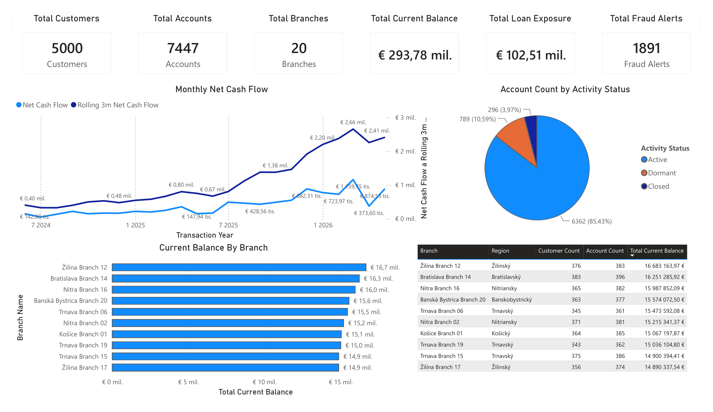
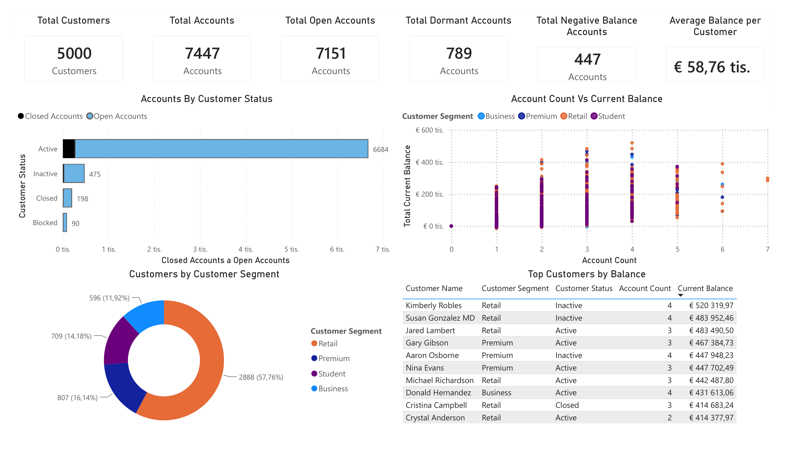
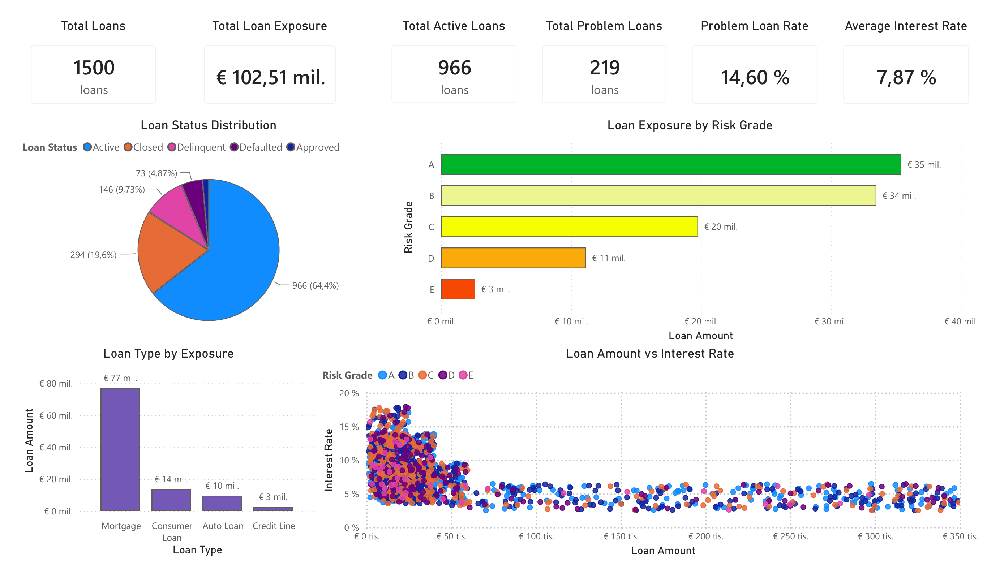
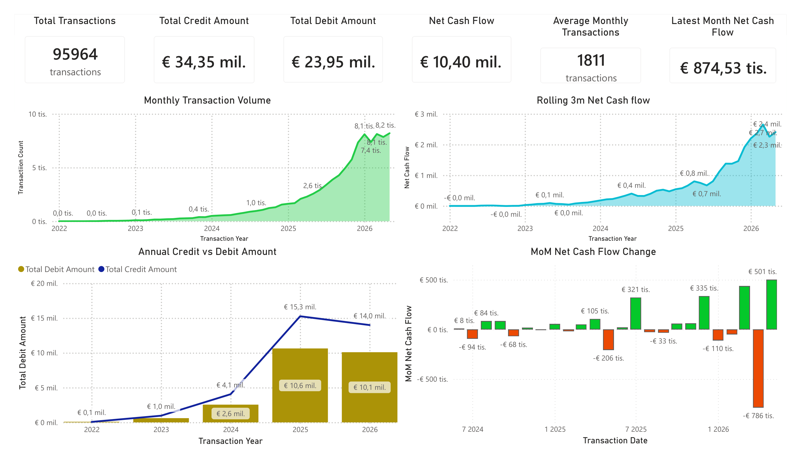
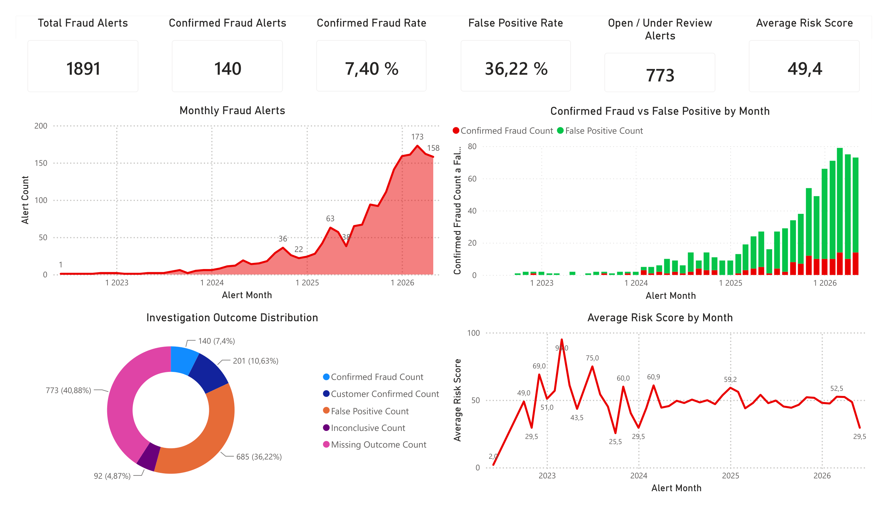

# Banking Customer, Loan & Transaction Risk Analytics

**End-to-end data analytics project focused on customer portfolio, account activity, loan risk, transaction flows and fraud monitoring in a synthetic retail banking environment.**

The project covers the full workflow from raw PostgreSQL tables to SQL data quality checks, cleaned analytical views, Python/pandas CSV exports and a final Power BI dashboard.

---

# Dashboard Preview

## Executive Banking Overview



## Customer & Account Portfolio



## Loan Portfolio & Delinquency



## Transaction Activity



## Fraud & Data Quality Monitoring



---

# Project Highlights

* Built a complete banking analytics workflow from raw data to Power BI dashboard
* Performed SQL data profiling and data quality checks
* Created clean SQL views for customers, accounts, loans, transactions and fraud alerts
* Built analytical reporting views for Power BI
* Used SQL window functions for month-over-month and rolling 3-month analysis
* Exported dashboard-ready CSV files using Python and pandas
* Created a 5-page Power BI dashboard focused on banking KPIs and risk monitoring
* Added reconciliation checks to validate final reporting outputs

---

# Business Focus

## Customer & Account Portfolio

* customer count
* account count
* open and dormant accounts
* negative balance accounts
* customer segments
* account activity status
* branch balance distribution

## Loan Portfolio & Delinquency

* total loans
* loan exposure
* active loans
* problem loans
* problem loan rate
* exposure by risk grade
* loan type distribution
* loan amount vs interest rate analysis

## Transaction Activity

* total transactions
* credit and debit amounts
* net cash flow
* rolling 3-month cash flow
* month-over-month cash flow change

## Fraud & Data Quality Monitoring

* total fraud alerts
* confirmed fraud alerts
* confirmed fraud rate
* false positive rate
* open / under review alerts
* average risk score
* investigation outcome distribution

---

# Tech Stack

| Tool                 | Purpose                                    |
| -------------------- | ------------------------------------------ |
| **PostgreSQL / SQL** | Data profiling, cleaning, analytical views |
| **Python / pandas**  | Export pipeline from SQL views to CSV      |
| **Power BI**         | Dashboard and reporting layer              |
| **DAX**              | KPI measures, rates and calculated metrics |
| **VS Code**          | Project structure and development          |

---

# Project Workflow

```text
Raw PostgreSQL Tables
        ↓
SQL Data Profiling
        ↓
SQL Data Quality Checks
        ↓
Clean SQL Views
        ↓
Analytical Reporting Views
        ↓
Python / pandas CSV Export
        ↓
Power BI Dashboard
```

---

# Repository Structure

```text
banking-customer-loan-transaction-risk-analytics/
│
├── assets/
│   └── dashboard/
│       ├── executive_overview.png
│       ├── customer_account_portfolio.png
│       ├── loan_portfolio_delinquency.png
│       ├── transaction_activity.png
│       └── fraud_quality_monitoring.png
│
├── output/
│   └── csv/
│       ├── account_activity_monitoring.csv
│       ├── branch_account_portfolio.csv
│       ├── customer_account_portfolio.csv
│       ├── fraud_monitoring_summary.csv
│       ├── loan_portfolio_base.csv
│       └── monthly_transaction_summary.csv
│
├── powerbi/
│   └── banking_customer_loan_transaction_risk_dashboard.pbix
│
├── python/
│   └── export_dashboard_data.py
│
├── sql/
│   ├── 01_data_profiling.sql
│   ├── 02_data_quality_checks.sql
│   ├── 03_clean_views.sql
│   ├── 04_customer_and_account_views.sql
│   ├── 05_loan_risk_views.sql
│   ├── 06_transaction_fraud_views.sql
│   └── 07_reconciliation_checks.sql
│
└── README.md
```

---

# SQL Layer

The SQL part of the project is split into structured scripts:

| File                                | Purpose                                                        |
| ----------------------------------- | -------------------------------------------------------------- |
| `01_data_profiling.sql`             | Raw table profiling, row counts, date ranges, duplicate checks |
| `02_data_quality_checks.sql`        | Orphan records, invalid values and business rule checks        |
| `03_clean_views.sql`                | Clean and valid row-level SQL views                            |
| `04_customer_and_account_views.sql` | Customer, account and branch reporting views                   |
| `05_loan_risk_views.sql`            | Loan portfolio and delinquency views                           |
| `06_transaction_fraud_views.sql`    | Transaction and fraud monitoring views                         |
| `07_reconciliation_checks.sql`      | Final validation and row count reconciliation                  |

---

# Data Quality Checks

The raw dataset contains realistic data quality issues, including:

* duplicate customer IDs
* missing customer references
* orphan accounts, cards, loans, loan payments, transactions and fraud alerts
* invalid transaction amounts
* invalid fraud risk scores
* transactions after account closure
* late loan payments with invalid days past due
* loans without payment schedules
* overpaid loan installments
* inconsistent transaction directions

These issues were identified, documented and handled through SQL checks and clean reporting views.

---

# Final Reporting Views

The main Power BI source views are:

```text
customer_account_portfolio
branch_account_portfolio
account_activity_monitoring
loan_portfolio_base
monthly_transaction_summary
fraud_monitoring_summary
```

Final exported row counts:

| Output                        |  Rows |
| ----------------------------- | ----: |
| `customer_account_portfolio`  | 5,000 |
| `branch_account_portfolio`    |    20 |
| `account_activity_monitoring` | 7,447 |
| `loan_portfolio_base`         | 1,500 |
| `monthly_transaction_summary` |    53 |
| `fraud_monitoring_summary`    |    45 |

---

# Power BI Dashboard Pages

## 1. Executive Banking Overview

High-level banking KPIs, recent net cash flow trend, account activity status and branch balance ranking.

## 2. Customer & Account Portfolio

Customer and account KPIs, customer status, customer segments, account count vs balance and top customers by balance.

## 3. Loan Portfolio & Delinquency

Loan exposure, active and problem loans, risk grade exposure, loan type exposure and interest rate analysis.

## 4. Transaction Activity

Transaction volume, credit and debit amounts, net cash flow, rolling 3-month trend and month-over-month cash flow change.

## 5. Fraud & Data Quality Monitoring

Fraud alerts, confirmed fraud rate, false positive rate, open investigations and average risk score trend.

---

# Key Skills Demonstrated

## SQL

* data profiling
* data quality checks
* clean SQL view creation
* analytical reporting views
* joins and CTEs
* conditional aggregation
* window functions
* `ROW_NUMBER()`
* `LAG()`
* rolling calculations
* month-over-month analysis
* reconciliation checks

## Python / pandas

* SQL view export pipeline
* PostgreSQL connection
* CSV generation for Power BI
* lightweight reporting data pipeline

## Power BI

* KPI cards
* line charts
* donut charts
* horizontal bar charts
* column charts
* scatter plots
* tables
* dashboard page design
* DAX measures and rates
* visual-level filters
* business reporting layout

---

# How to Run

## 1. Run SQL Scripts

Run the SQL scripts in order from the `sql/` folder:

```text
01_data_profiling.sql
02_data_quality_checks.sql
03_clean_views.sql
04_customer_and_account_views.sql
05_loan_risk_views.sql
06_transaction_fraud_views.sql
07_reconciliation_checks.sql
```

## 2. Export CSV Files

Update the PostgreSQL connection string in:

```text
python/export_dashboard_data.py
```

Run:

```bash
python python/export_dashboard_data.py
```

The exported CSV files will be saved into:

```text
output/csv/
```

## 3. Open Power BI Dashboard

Open the Power BI report:

```text
powerbi/banking_customer_loan_transaction_risk_dashboard.pbix
```

Refresh the data source paths if needed.

---

# Notes

* The dataset is synthetic and created for portfolio purposes.
* `Total Loan Exposure` is calculated as the sum of original loan amounts.
* Interest rates are stored as percentage-point values and adjusted in Power BI for percentage formatting.
* Fraud rate KPIs are calculated from alert counts instead of summing pre-calculated percentage columns.
* Loan payment coverage can exceed 100% because the synthetic dataset contains overpaid installments.

---

# Disclaimer

This project uses a synthetic banking dataset. It does not represent real customers, real accounts, real transactions or any real financial institution.